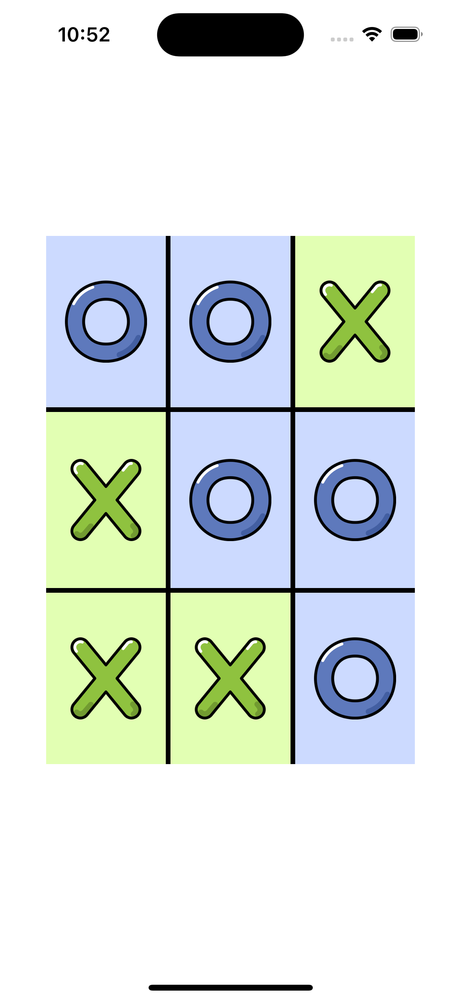

# Noughts and Crosses

## About

This application is a tic-tac-toe interface (no logic) developed in React Native. It showcases responsive web design as well as the use of deeply-nested `View` components. To run the code online, visit <https://snack.expo.dev/@jingling/noughtsandcrosses>.
